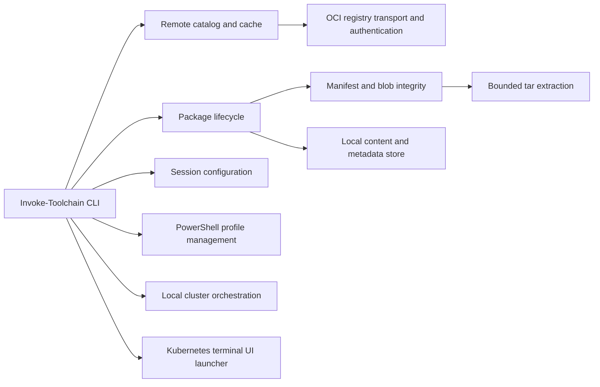

# Architecture

Toolchain builds its source files into one PowerShell module for distribution,
while keeping development responsibilities separated:

- `registry-transport.ps1` owns HTTP authentication, retry, and bounded response handling.
- `registry-catalog.ps1` owns registry tag discovery and fallback behavior.
- `catalog-cache.ps1` owns short-lived and stale-if-error package discovery data.
- `registry.ps1` owns immutable manifests, blobs, and package-definition integrity.
- `remote-catalog.ps1` converts registry tags into tool and model views.
- `package-lifecycle.ps1` owns install, save, update, prune, and removal operations.
- `package.ps1` owns package references and local resolution.
- `shell.ps1` applies package definitions to the current or managed session.
- `profile.ps1` safely manages opt-in package loads in the user's current-host PowerShell profile.
- `cluster.ps1` manages isolated local kind, k0s, and k3s cluster lifecycles over Docker.
- `k9s.ps1` selects a current, managed, or explicit kubeconfig and launches the catalog-provisioned K9s executable.

`build.ps1` follows those dot-source relationships and produces the single
`Toolchain.psm1` shipped in releases.

## Platform boundary

The supported interactive client is Windows because package installation,
cache paths, session configuration, and long-path handling use Windows
semantics. The OCI transport, package-definition validation, bounded archive
extraction, and Toolchains producer/consumer contract are portable and are also
validated on Linux. CI runs the complete suite on Windows PowerShell 5.1 and
PowerShell 7, plus that explicit portable boundary on Linux.
