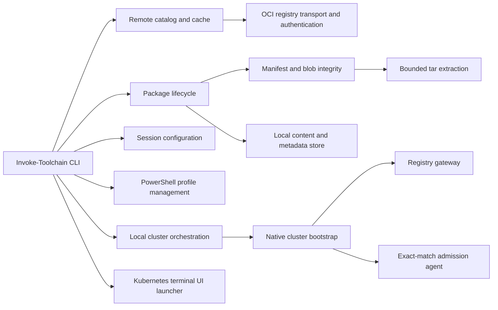

# Architecture

CI enforces explicit performance budgets for fresh-process startup and complete 10,000-marker catalog classification. The defaults are 3,000 ms and 2,000 ms and can be tightened through `TOOLCHAIN_STARTUP_BUDGET_MS` and `TOOLCHAIN_CATALOG_BUDGET_MS`.

Toolchain builds its source files into one PowerShell module for distribution,
while keeping development responsibilities separated:

- `registry-transport.ps1` owns HTTP authentication, retry, and bounded response handling.
- `registry-catalog.ps1` owns registry tag discovery and fallback behavior.
- `catalog-cache.ps1` owns short-lived and stale-if-error package discovery data.
- `registry.ps1` owns immutable manifests, blobs, and package-definition integrity.
- `remote-catalog.ps1` converts registry tags into tool and model views.
- `package-lifecycle.ps1` owns install, save, update, prune, and removal operations.
- `package.ps1` owns package references and local resolution.
- `shell.ps1` applies package definitions to the current or managed session.
- `profile.ps1` safely manages opt-in package loads in the user's current-host PowerShell profile.
- `cluster.ps1` manages isolated local kind, k0s, and k3s cluster lifecycles over Docker.
- `bootstrap.ps1` reconciles Toolchain-owned registry, state, optional Git, and admission infrastructure into managed or external Kubernetes clusters.
- `agent/` builds the small multi-architecture admission and registry-gateway binary published with each Toolchain release.
- `k9s.ps1` selects a current, managed, or explicit kubeconfig and launches the catalog-provisioned K9s executable.

`build.ps1` follows those dot-source relationships and produces the single
`Toolchain.psm1` shipped in releases.

## Platform boundary

The interactive client supports Windows, Linux, and macOS. Platform and
architecture are detected through .NET runtime metadata, PATH mutation uses the
native separator and variable casing, and local references use junctions only
on Windows and symbolic links elsewhere. CI runs the complete Windows suites and
the cross-platform project, environment, registry, definition, extraction, and
built-module boundaries on Linux and macOS.
